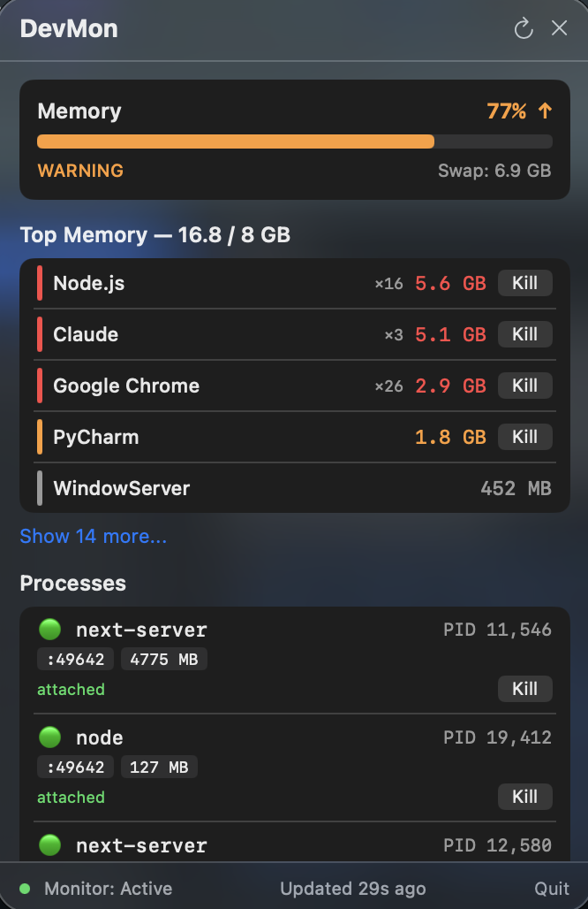

# DevMon

A lightweight macOS menu bar app and CLI that monitors developer processes, tracks memory pressure, and automatically cleans up orphaned dev servers.

Built for developers who run Node.js, Vite, Webpack, Next.js, and other dev servers that sometimes get left behind.

   

<p align="center">
  
</p>

## What It Does

- **Monitors memory pressure** with color-coded status bar indicator and trend arrows
- **Detects orphaned dev processes** (node, vite, webpack, etc.) running without a terminal
- **Auto-kills stale processes** after configurable idle thresholds (aggressive under memory pressure)
- **Shows listening ports** in the 3000-9000 range with connection counts
- **Cleans dev caches** (npm, pnpm, Homebrew, JetBrains, Playwright, stale node_modules)
- **Sends notifications** when memory crosses 80%
- **Menu bar app** with one-click process killing and live stats

## Install

```bash
git clone https://github.com/fdsmith22/devmon.git
cd devmon
bash install.sh
```

That's it. The installer:
1. Copies scripts to `~/.local/bin/`
2. Compiles the Swift menu bar app from source
3. Installs LaunchAgents for automatic monitoring
4. Starts the menu bar app

### Requirements

- **macOS 11+** (Big Sur or later)
- **Xcode Command Line Tools** — install with `xcode-select --install`
- No other dependencies

> **Tested on macOS.** Not tested on Linux or Windows.

## Usage

### Menu Bar

After install, look for the colored dot + percentage in your menu bar:

| Icon | Meaning |
|------|---------|
| `🟢 45%` | Memory OK |
| `🟡 65%` | Memory warning |
| `🔴 82% ↑` | Critical, rising |

Click it to open the popover with:
- Memory pressure bar + swap usage
- Top memory consumers (with Kill buttons — protected for system processes)
- Orphaned dev processes with age tracking
- Listening ports with connection counts
- Quick actions (clean caches, view log, pause/resume)

**Keyboard shortcut:** `Cmd+Shift+M` toggles the popover.

### CLI

```bash
devmon status          # Memory pressure, orphaned processes, listening ports
devmon kill            # Interactive process killer
devmon clean           # Clean caches (npm, pnpm, Homebrew, JetBrains, etc.)
devmon clean --dry-run # Preview what would be cleaned
devmon log             # Tail the live log
devmon pause           # Pause automatic monitoring
devmon resume          # Resume monitoring
devmon install         # Reload LaunchAgents
devmon uninstall       # Unload LaunchAgents
```

### Example: `devmon status`

```
DevMon Status
═══════════════════════════════
Memory Pressure: 52% ▓▓▓▓▓░░░░░ [OK]
Swap Usage: 1024 MB

Dev Processes (orphaned):
  PID 12345  node /Users/me/project/server.js   age: 2h 15m  ← will kill in 28m

Listening Ports:
  :3000  PID 12345  node  (3 connections)
  :5173  PID 67890  node  (0 connections) ← stale

Monitor: ACTIVE
```

## How It Works

### Three Components

| Component | What | When |
|-----------|------|------|
| **Monitor** (`devmon run`) | Detects orphaned dev processes and kills them after idle threshold | Every 5 minutes via launchd |
| **Cache Cleaner** (`devmon-cache-clean`) | Cleans stale JetBrains caches, npm/pnpm stores, old node_modules, Homebrew downloads | Weekly (Sunday 3am) via launchd |
| **Menu Bar App** (`DevMon.app`) | SwiftUI popover showing memory, processes, ports with kill buttons | Always running, refreshes every 30s |

### Orphan Detection

A process is considered "orphaned" when:
1. It matches a dev process pattern (node, vite, webpack, etc.)
2. It has no controlling terminal (`tty == ??`)
3. Its parent PID is 1 (adopted by init) or the parent is dead

Orphans are tracked by age. Under normal memory pressure they're killed after **30 minutes**. Under emergency pressure (80%+) the threshold drops to **10 minutes**.

### Protected Processes

The menu bar app protects critical system processes from accidental killing:
`WindowServer`, `loginwindow`, `kernel_task`, `Finder`, `Dock`, `SystemUIServer`, `launchd`

## Configure

Edit `~/.config/devmon/config.sh`:

```bash
# Memory thresholds (percentage)
DEVMON_WARN_THRESHOLD=60
DEVMON_EMERGENCY_THRESHOLD=80

# Idle thresholds (seconds before orphan is killed)
DEVMON_IDLE_NORMAL=1800      # 30 minutes
DEVMON_IDLE_EMERGENCY=600    # 10 minutes under memory pressure

# Port scan range
DEVMON_PORT_MIN=3000
DEVMON_PORT_MAX=9000

# Process patterns (extended regex)
DEVMON_PROCESS_PATTERN='node|next-server|vite|webpack|esbuild|postcss|turbopack|ts-node|tsx'

# Never kill these (substring match against full command)
DEVMON_WHITELIST=(
  "mongod"
  "code-helper"
  "copilot"
  ".vscode"
  "prettier"
  "eslint_d"
)

# Cache cleanup ages (days)
DEVMON_CACHE_JETBRAINS_MAX_DAYS=7
DEVMON_CACHE_NODE_MODULES_MAX_DAYS=30
DEVMON_CACHE_HOMEBREW_MAX_DAYS=14

# Notifications (0 to disable)
DEVMON_NOTIFY=1
```

## Uninstall

```bash
cd devmon
bash uninstall.sh
```

This removes all binaries, the app bundle, and LaunchAgents. Your config (`~/.config/devmon/`) and logs (`~/Library/Logs/devmon/`) are preserved.

## Project Structure

```
devmon/
├── install.sh                # One-command installer
├── uninstall.sh              # Clean uninstaller
├── bin/
│   ├── devmon                # Main CLI (bash)
│   └── devmon-cache-clean    # Cache cleanup utility (bash)
├── src/
│   └── DevMonMenuBar.swift   # Menu bar app (SwiftUI)
├── config/
│   └── config.sh             # Default configuration
├── launchd/
│   ├── com.devmon.monitor.plist.template
│   ├── com.devmon.cache-clean.plist.template
│   └── com.devmon.menubar.plist.template
└── app/
    └── Info.plist            # macOS app bundle metadata
```

## License

MIT
